# Global Superstore Analysis
---

---
## Introduction
This a Power BI project on Global Superstore analysis.  Global Superstore is a global online retailer based in New York, boasting a broad product catalog and aiming to be a one-stop-shop for its customers. Global The superstore’s clientele, hailing from 147 different countries, can browse through an endless offering with more than 10,000 products. This large selection comprises three main categories: office supplies (e.g., staples), furniture (e.g., chairs), and technology (e.g., smartphones).

## Problem Statement
1.  What are the three countries that generated the highest total profit for Global Superstore in 2014?
b) For each of these three countries, find the three products with the highest total profit. Specifically,
what are the products’ names and the total profit for each product?
2.  Identify the 3 subcategories with the highest average shipping cost in the United States.
3. Assess Nigeria’s profitability (i.e., total profit) for 2014. How does it compare to other African countries?
b) What factors might be responsible for Nigeria’s poor performance? You might want to investigate shipping costs and the average discount as potential root causes.
4.  a) Identify the product subcategory that is the least profitable in Southeast Asia.
Note: For this question, assume that Southeast Asia comprises Cambodia, Indonesia, Malaysia, Myanmar
(Burma), the Philippines, Singapore, Thailand, and Vietnam.
b)  Is there a specific country in Southeast Asia where Global Superstore should stop offering the subcategory identified in 4a?
5.  a) Which city is the least profitable (in terms of average profit) in the United States? For this analysis,discard the cities with less than 10 Orders.
b) Why is this city’s average profit so low?
 6.  Which product subcategory has the highest average profit in Australia?
 7.  Who are the most valuable customers and what do they purchase?

Skills demonstrated
- Power Query
- Data Modeling
- Data Cleaning
- Data Visualization

## Data Cleaning

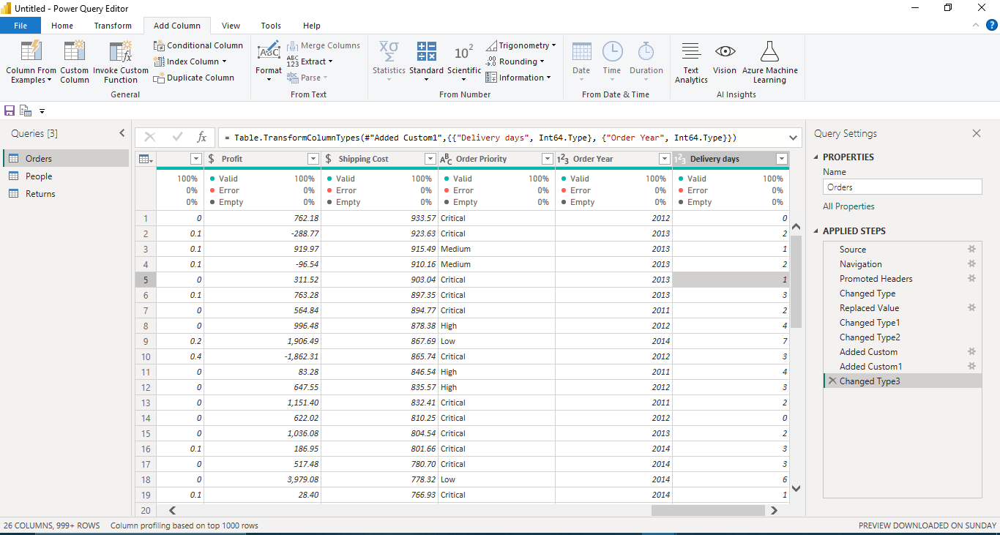

Empty spaces were replaced with 0, the data type was changed to the right one and new columns were created for Year and Delivery day.

## Data Modelling
New relationships was created since there was no automatically derived relationships.

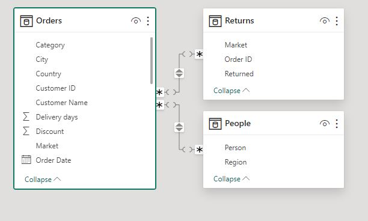

There are 2-dimension tables  and 1 fact table. The dimension tables are all joined to the fact table with a one-to-many relationship.

## Visualization
Two dashboards were created 

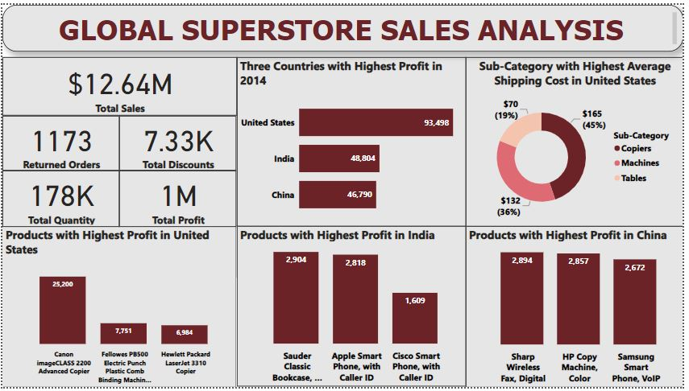

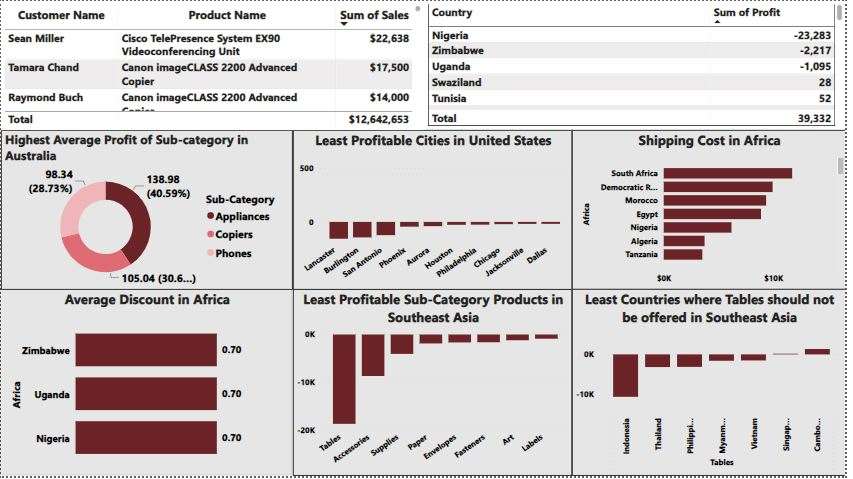

## Analysis

### Countries with highest Profit

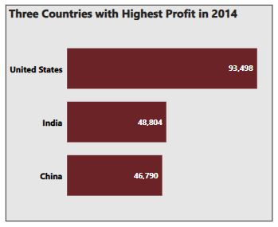

In 2014 "United States" generated the highest total profit for global superstore,followed by "India" then "China".

b.  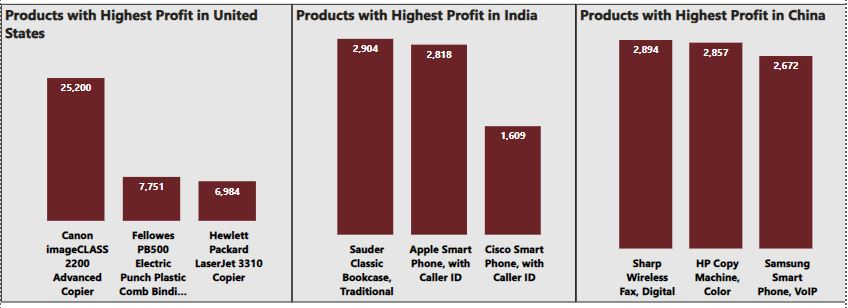

This image shows the three products with highest profit for each top 3 countries with highest profit.

### Sub-category Average shipping cost in United States

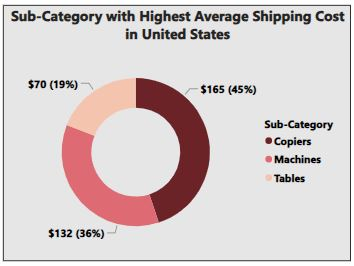

The 3 sub-category average shipping cost in United States are the Copiers $165, Machines $132 and Tables $70.

### Nigeria's Profitability

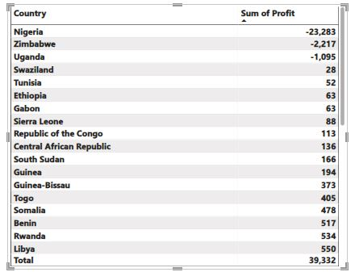

Nigeria has the lowest profit in 2014 which gives rise to high total loss of about -23,283 compared to other African country.

b.  The factors responsible for Nigeria's performance  are the average discount and shipping cost.

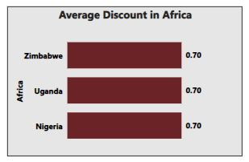

The average discount of Nigeria is relatively too much for a country with low peformance.

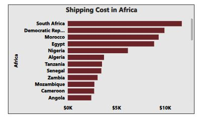

 The shipping cost is also too high for a country with low profit, Since the shipping cost is high, it will be difficult for the customers outside the country to patronize.

 ### Least Profitable Sub-category in Southeast Asia

 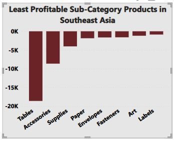

 The least profitable sub-category in Southeast Asia is "Tables"

 b.  The country in Southeast Asia that needs to stop offering the sub-category "Tables" is "Indonesia" because it only brings them great loss.

 ### Least profitable City in United States
 
  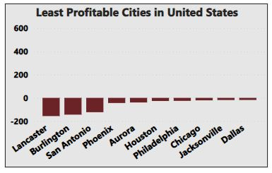

  The least proftable city in United States after discarding those less than 10 order is "Lancaster" and their profit is so low (-157.33) because instead of generating a great profit they are running at a great loss.

  ### Product with highest average profit in Australia

  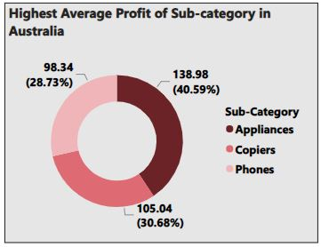

  The sub-category product with the highest average profit in Australia is "Appliances"

  ### Most Valuable Customers

  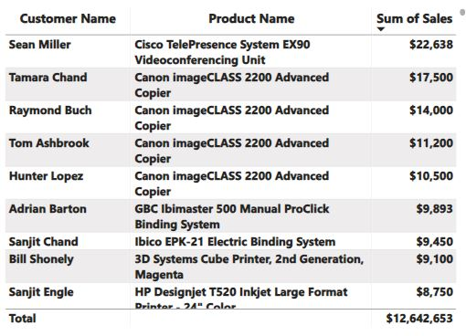

  The most valuable customers are "Sean Miller and Tamara Chand".
 -  Sean Miller purchased "Cisco Telepresence System EX90 Videoconferencing Unit" at the sum of $22,639.
  - Tamara Chand purchased "Canon imageCLASS 2200 Advanced copier" at the sum of $17,500.

  ## Conclusion
- The Total sales of Global Superstore is $12.64 million
-  The Total profit amount to the sum of $1 million
- The Total quantity of orders is 178,000
-  The Total number of returned orders is 1173
- The Total discounts on products is 7.33K
  

